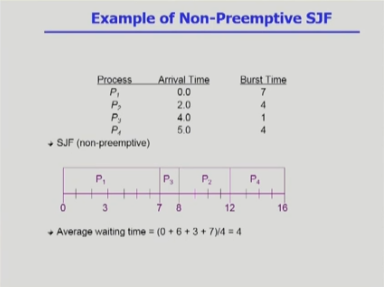
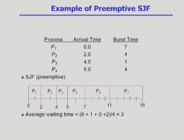

## CPU 스케줄링

CPU burst 가 짧은 경우 IO가 빈번함.

반대의 경우 IO 간섭이 적음.

CPU Ready queue 에 들어있는 스케줄을 잘 관리 해줘야 한다.

1. CPU를 쓰고자하는 프로세스에 CPU를 줘야 하는데 이것을 잘 관리해서 결정해야한다.
2. CPU를 프로세스에 주고 나서 다시 뺏을 것인가 말것인가.

IO bound job ( 이용자들이 ) 기다리는 것을 최소화 하기 위해 스케줄링을 한다.

CPU 스케줄링 알고리즘 

- nonpreemptive - CPU 강제로 빼앗지 않고 자진 반납
- preemptive - CPU 강제로 뺏음

비선점형 / 선점형 두가지로 나뉨.

스케줄링 알고리즘 성능 척도? ( Scheduling Criteria )

Performance Index ( = Performance Measure , 성능 척도)

CPU 이용률 Utilization

Throughput ( 처리량 )

=========

프로세스 입장 ( 가능하면 내가 빨리 CPU를 받고 IO 후 나가고 싶어함 )

Turnaround time ( 소요시간,  반환 시간 )

CPU Bust 를 쓰고 들어와서 다 쓰고 나가는데 걸린 시간.

Waiting Time ( 대기 시간 )

- CPU를 받기 전 대기 시간

Response Time ( 응답 시간 )

- time sharing 과정에서 얼마나 빨리 받는지?  

만약 중국집 주방장을 고용했다고 한다면,  
중국집 주방장이 CPU가 된다.

CPU 이용률과 처리량은 주방장이 음식을 얼마만큼의 시간동안 최대한 많이 만드는지를  
판단하는 척도가 되고,

이용하는 입장에서는 5만원짜리 코스 요리를 시키는 이용자와 짜장면 한그릇을 시키는 이용자가  
있는데 해당 주문에 맞는 음식을 만들 때 코스 요리의 경우 많이 시간이 소요되기 때문에  
해당 Turnaround time을 고려하여 짜장면을 시킨 이용자가 코스 요리 음식을 다 만들고 만들어 주면  
당연히 오래 기다려야 하기 때문에 이런 부분을 스케줄링 선정에서 고려해야한다.

Waiting time 은 밥을 먹는 시간이 아닌 기다리는 시간

Response time 은 밥이 나오기까지 걸리는 시간 동안 중간에 물이나 반찬 등이 나오듯이  
중간 중간 응답이 되는 시간으로 이 시간이 짦을 수록 좋다.
## CPU 스케줄링 알고리즘
## FCFS ( first-come-first-serve )
- 일명 선착순
- 만약 CPU 사용이 오래걸리는 프로세스가 먼저 도착해서 CPU 를 사용하게 되면 나머지 짦은 프로세스가  
오래 기다려야하는 문제가 생김. Convoy effect

## SJF ( shortest-job-first )
- 가장 짦은 CPU 처리가 가능한 프로세스를 가장 먼저 처리하도록 스케줄링하는 것.
- 전체 average waiting time 이 최소화 된다.
- nonpreemptive 비선점 기다리는 프로세스 중 가장 짦은 프로세스에게 CPU를 줬으면 이후 더 짦은 프로세스가  
오더라도 이미 사용 중은 프로세스가 끝이 나야 준다.

- preemptive 선점 비선점과 반대로 기다리는 프로세스 중 가장 짦은 프로세스에게 CPU를 넘겨줬지만, 
이후 더 짦은 프로세스가 오게 되면 이미 사용 중인 프로세스에게서 CPU를 빼앗아 간다.  
그래서 Shortest-Remaining-Time-First 라고 도 한다.

### SJF 문제점
- Long process 가 Starvation 문제가 있을 수 있다.
- 100초짜리 프로세스는 1초짜리 프로세스들이 전부 끝나야 CPU를 할당받는데,  
끝났다 생각해도 다시 5초짜리 프로세스들이 Ready queue에 들어오면 또 기다려야한다.  
- 프로세스 본인이 CPU를 얼마나 쓰고 나가는지 알수 없다. 추정만 가능하다
- 예측치가 가장 적은 프로세스로 SJF 적용이 가능하다.